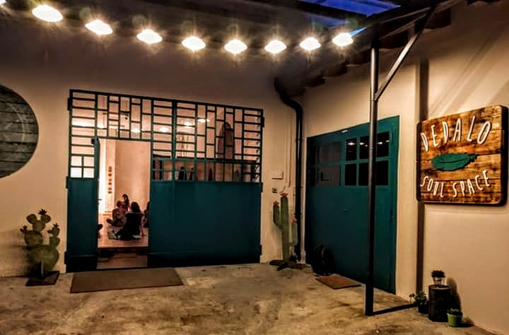

**CALENDARIO CORSI!**

| **LUNEDÌ** | **MARTEDÌ** | **MERCOLEDÌ** | **GIOVEDÌ** | **VENERDÌ** |
| --- | --- | --- | --- | --- |
| | h. 10.00 - 11.00 **Pilates** | | h. 7.00 - 8.00 **Yoga al Risveglio,** con Kyara | |
| h. 19.00 - 20.00 Pilates | h. 19.00 - 20.00 **Anukalana Yoga** , con Silvia | h. 19.00 - 20.00 **Hata Yoga,** con Kyara | | h. 18.00 -19.00 **Vinyasa Yoga**, con Laura |
| h. 20.00 - 22.30 Canto (Wild Flowers) | h. 20.30 -21.30 Mindfulness | | |

**I NOSTRI CORSI ORA SONO ONLINE!**

**Haha Yoga**

Mercoledì dalle 19.15 alle 20.15.

Puoi inserirti anche a corso cominciato!

**Insegnante** : **CHIARA GRASSELLI**

Yoga Kyårā Tridevi, Chiara Grasselli, si è avvicinata allo Yoga quando era poco più che una bambina ed è stato &quot;amore a prima vista&quot;. Dopo aver praticato Yoga per diversi anni, ha sentito il desiderio di approfondire gli aspetti pratici e filosofici di questa antica disciplina conseguendo il titolo di Insegnante Hata Yoga 200H riconosciuta da Yoga Alliance e CONI presso il Centro Anidra di Borzonasca, sta attualmente ultimando la formazione di approfondimento di Hata Yoga 300H presso il CentrOlistico di Sesto San Giovanni e partecipa costantemente a workshop tematici.

Lo Yoga che propone è una fusione di elementi di Hata, Vinyasa, Yin, Kundalini, Pranayama, Nidra e Meditazione che si integrano e sviluppano di volta in volta.

È traduttrice, apicoltrice e mamma, ama viaggiare e connettersi con la natura, elemento chiave che abbiamo ritrovato in occasione degli appuntamenti Yoga in Natura.

Trova nell&#39;insegnamento dello Yoga una preziosa occasione di ricerca e condivisione,

**VINYASA YOGA**
Con Laura Pozzoli

**Quando** : Il venerdì dalle 18.00 alle 19.00

**Puoi inserirti anche a corso cominciato!**

Laura Pozzoli insegna Hatha Yoga dal 2015 a Canzo e a Lecco. Si è formata presso la scuola Centro Como con Luisa Azzerboni ed il metodo Yoga Essenziale, ottenendo la certificazione all&#39;insegnamento nel 2017. Da allora ha proseguito la sua formazione in Italia e in Spagna, seguendo workshop e master di vario tipo con insegnanti italiani ed internazionali. Ha visitato l&#39;India nel 2017 per conoscere le radici dello yoga ed esplorarne i luoghi sacri. Il suo stile è hatha yoga su cui si fondono elementi di vinyasa, yin yoga e di yogaterapia.

**ANUKALANA YOGA**
ConSilvia Shyamali

**Quando** : il martedì dalle 19.00 alle 20.00

**Puoi inserirti anche a corso cominciato!**

E&#39; un&#39;insegnante di hatha/vinyasa yoga, con una certificazione di 200 hrs yoga alliance. Attualmente ha inoltre concluso il secondo anno di formazione in Anukalana yoga presso la scuola Samadhi di Firenze di Jacopo Ceccarelli.

La pratica che propone è incentrata sulla morbidezza, la fluidità del corpo e la naturalezza del respiro, caratteristiche peculiari dello stile Anukalana. Questa pratica aiuterà a ritrovare il respiro, dargli spazio e profondità, riportandolo a uno stato più naturale e libero. Attraverso la pratica degli asana si assaporerà l&#39;espansione e la ritrazione, che respiro dopo respiro prenderanno spazio nel nostro corpo, assecondando quell&#39;impulso vitale che permea tutta la nostra realtà. Acquisendo così morbidezza e consapevolezza, non solo del corpo e del suo movimento, ma anche della mente.
