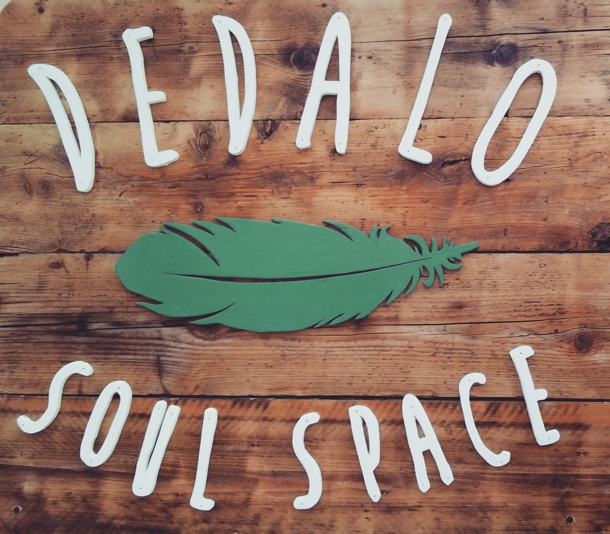

**Il Dedalo**

Yoga | Arti | Socialità | Consapevolezza

**Il Dedalo** è uno spazio per l'anima, la creatività, la cura e la bellezza di condividere.

E' il secondo progetto dell'Associazione "Tra Le Nuvole", che gestisce Spazio Bizzarro. E' un posto in cui trovare corsi, ma soprattutto **esperienze che fanno bene** al corpo e alla mente, dallo yoga al canto, dalla meditazione all'arte.

Lo spirito del Dedalo è quello di **ospitare**, **integrare**, **creare connessioni** tra le persone, stare insieme, raccontarsi delle storie davanti al fuoco e **condividere** momenti di bellezza, alchimia, trasformazione, stupore.

In un momento in cui il virtuale rischia di renderci più soli di quanto pensiamo, con questo progetto sentiamo il bisogno di tornare a guardarci negli occhi, ricominciare a sentire, di stare nelle relazioni. Non è un luogo in cui prendere e basta, è uno spazio in cui **scambiare**: ognuna delle persone che viene porta la sua energia e qualità, che è preziosa per nutrire la nostra consapevolezza e preservare la nostra umanità.
